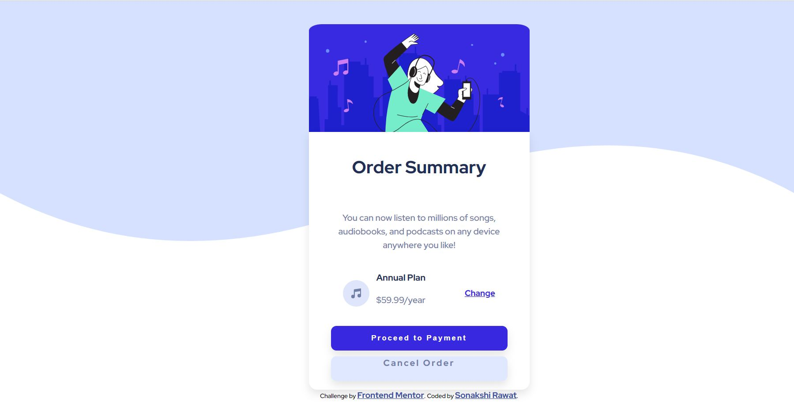

 <h3>Frontend Mentor - Order Summary Card Challenge</h3>
 

 

 This is my solution to <strong>Order Summary Card </strong> challenge by frontendmentor.io.  
 Frontend mentor helps in improving your coding skills by building realistic projects. 

 

 <h3>Screenshot</h3>
 
 

 <h3>Live URL link - <a href=" https://sonakshirawat.github.io/Order-Summary-Card/">Click here </a>
 </h3>
 

 <h3>My Process</h3>
 
 Started with writing down the markup in HTML. Then using CSS custom properties designed desktop view for the given problem. Later with the help of Chrome Dev Tools it was made responsive for every aspect ratio. 
 
 

 <h3>Built Using</h3>
 <ul>
 <li>HTML5 Markup Language</li>
 <li>CSS Custom Properties</li>
 </ul>